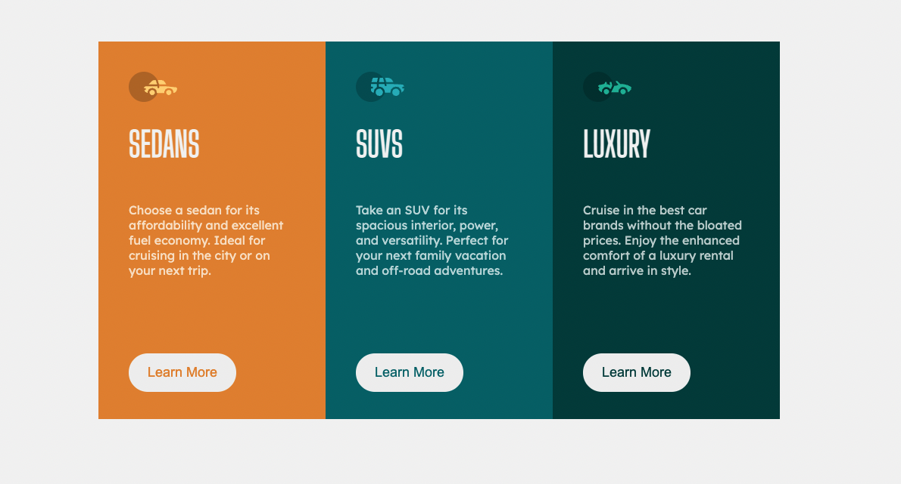

# Frontend Mentor - 3-column preview card component solution

This is a solution to the [3-column preview card component challenge on Frontend Mentor](https://www.frontendmentor.io/challenges/3column-preview-card-component-pH92eAR2-). Frontend Mentor challenges help you improve your coding skills by building realistic projects. 

## Table of contents

- [Overview](#overview)
  - [TODO](#TODO)
  - [The challenge](#the-challenge)
  - [Screenshot](#screenshot)
  - [Links](#links)
- [Author](#author)

## Overview

### TODO
- [x] Add the rounded corners
- [ ] Mobile responsive

### The challenge

Users should be able to:

- View the optimal layout depending on their device's screen size
- See hover states for interactive elements

### Screenshot

### Links

- Solution URL: [SOLUTION URL NOT UP YET]()
- Live Site URL: [LIVE SITE NOT UP YET]()

### What I learned

Got a better understanding of CSS positon and using flexbox, I hope to improve more on this later in the future.

## Author

- Frontend Mentor - [@nerdic](https://www.frontendmentor.io/profile/thenerdic)